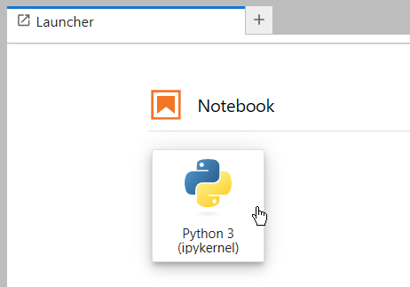
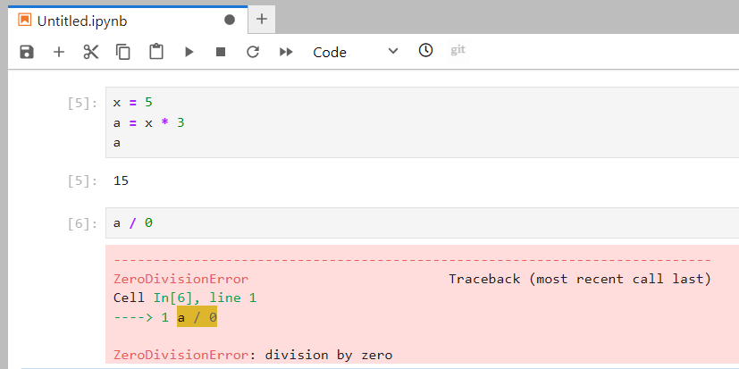
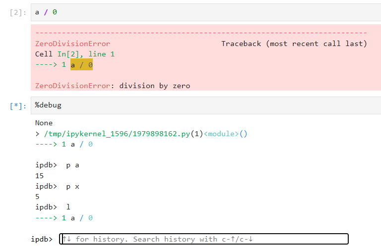
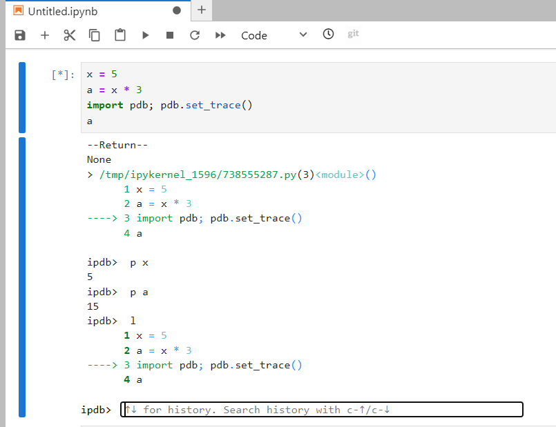
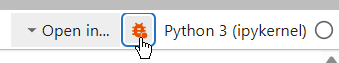
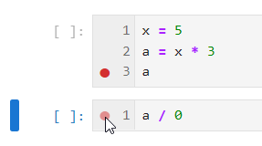
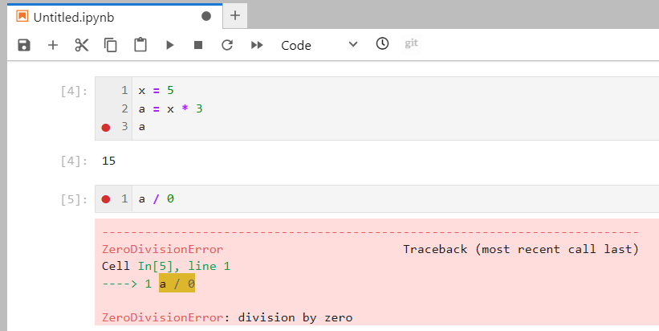
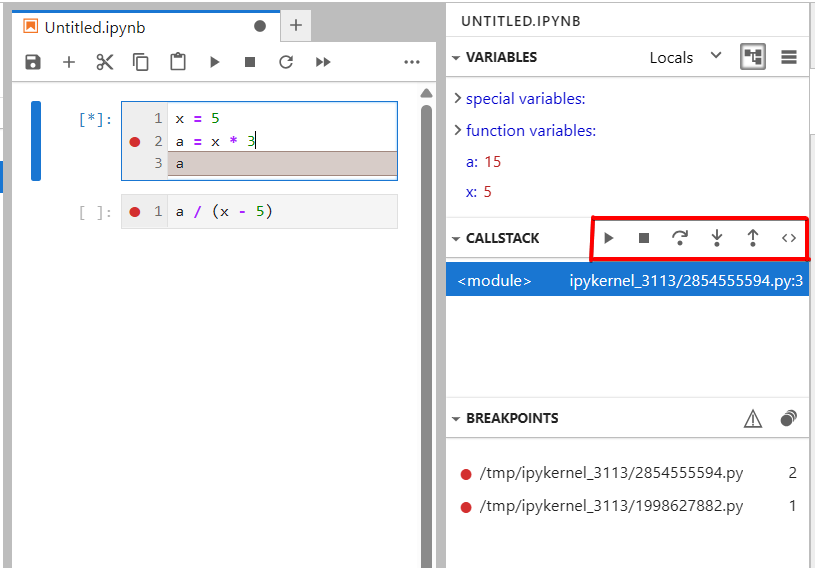
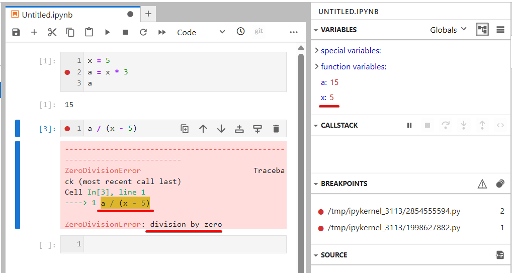

# Jupyter Notebook 

## Описание
Jupyter Notebook - это интерактивная среда, широко используемая для анализа данных, машинного обучения и научных исследований. Она поддерживает отладку через магические команды IPython, такие как `%debug`, для анализа ошибок post-mortem, и встроенный модуль `pdb` для установки точек остановки с помощью `pdb.set_trace()`.

## Основные возможности
- Магическая команда %debug для запуска отладчика после возникновения исключений.
- Интеграция с pdb для пошаговой отладки через pdb.set_trace().
- Выполнение кода по ячейкам с немедленным просмотром результатов.
- Интерактивная консоль для проверки переменных и экспериментов.
- Поддержка отображения данных и визуализаций в ячейках

## Установка
Jupyter Notebook можно установить через [официальный сайт](https://jupyter.org/install), [anaconda](https://anaconda.org/anaconda/jupyter) или [Docker](https://jupyter-docker-stacks.readthedocs.io/en/latest/).

## Использование через pdb
1. Открыть Jupyter Notebook в браузере и создать новый блокнот. 
2. Вставить код в ячейки и выполнить их с помощью `Shift+Enter`. 
3. Для анализа ошибки после исключения надо создать новую ячейку, ввести `%debug` и выполнить её. 
4. Для proactive отладки нужно вставить `import pdb; pdb.set_trace()` в код и выполнить ячейку. 
5. В отладчике используйте команды `pdb`, такие как `n` (next), `s` (step), `p variable` (print variable), для анализа состояния.

## Использование через debug в ipykernel
1. Открыть Jupyter Notebook в браузере и создать новый блокнот. 
2. Включить режим отладки и поставить точки остановки.  
3. Выполнить код с помощью `Shift+Enter`. 
4. Использовать панель отладки для пошагового выполнения, просмотра переменных и управления выполнением.  

## Ссылки
[Описание отладки через pdb в Jupyter Notebook](https://www.cambridge.org/core/resources/pythonforscientists/jupyterdb)
[Документация отладчика Jupyter Notebook](https://jupyterlab.readthedocs.io/en/latest/user/debugger.html)

