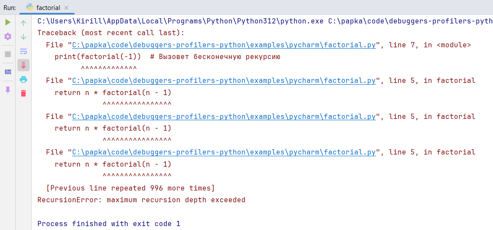

# Pycharm

## Описание

PyCharm - профессиональная IDE от JetBrains, созданная для Python-разработки. Её отладчик поддерживает точки остановки, пошаговое выполнение, анализ переменных и условные остановки.

## Основные возможности
- Установка брейкпоинтов для приостановки выполнения кода.
- Пошаговое выполнение (step over, step into, step out).
- Просмотр стека вызова функций.
- Просмотр и изменение значений переменных в реальном времени.
- Условные точки останова для остановки при выполнении условий.
- Точки остановки на исключениях для анализа ошибок.
- Интерактивная консоль отладки для выполнения кода в контексте.
- Поддержка удаленной отладки.

## Установка
1. Скачать PyCharm с официального сайта [JetBrains](https://www.jetbrains.com/pycharm/).
2. Установите программу, следуя инструкциям установщика.

## Использование
1. Открыть PyCharm, создать новый проект или открыть существующий.
2. Создать или открыть Python-файл в редакторе.
3. Установить точку остановки, щелкнув ЛКМ на левой границе редактора рядом с номером строки. _Опционально_ добавить условие на брейкпоинт.  
4. Нажать кнопку "`Debug`" в верхней панели инструментов или использовать сочетание клавиш `Shift+F9` для запуска отладки. 
5. Использовать панель отладки для пошагового выполнения, просмотра переменных и управления выполнением. 

## Пример
Рассмотрим функцию вычисления факториала, которая не проверяет отрицательные входные значения, что приводит к бесконечной рекурсии и `RecursionError`.

**Шаг 1.** Создадим файл `factorial.py` в PyCharm с функцией вычисления факториала: 

**Шаг 2.** Установим точку остановки на строке `if n == 0`:, щелкнув на левой границе редактора. 

**Шаг 3.** Нажмём кнопку "`Debug`" (иконка жука) для запуска отладки. 

**Шаг 4.** Выполнение остановится на условии. В панели "`Variables`" проверим значение n. Увидим, что n = -1, что указывает на проблему. 

**Шаг 5.** Используем кнопку "`Step Into`" (`F7`) для перехода в рекурсивный вызов. Обратим внимание, что n становится -2, -3 и так далее, указывая на бесконечную рекурсию.  

**Шаг 6.** Исправим код, добавив проверку отрицательных чисел. 

**Шаг 7.** Перезапустим программу и убедимся, что код вызовет `ValueError` с понятным сообщением. 

## Плюсы
- Мощный отладчик с поддержкой условных точек останова и удаленной отладки.
- Интеграция с автодополнением, рефакторингом и Git.
- Регулярные обновления и профессиональная поддержка.

## Минусы
- Высокое потребление ресурсов.
- Сложный интерфейс для новичков.
- Некоторые функции доступны только в платной версии Professional.

## Ссылки
- [Официальный сайт PyCharm](https://www.jetbrains.com/pycharm/)
- [Документация PyCharm](https://www.jetbrains.com/help/pycharm/)