# VS Code

## Описание
Visual Studio Code (VS Code) - легковесный редактор кода от Microsoft, который с расширением Python становится полноценной IDE. Его отладчик прост в использовании, поддерживает точки остановки, просмотр стека вызовов, переменных и интерактивную консоль.

## Основные возможности
- Установка брейкпоинтов для приостановки выполнения.
- Условные точки остановки для остановки при определенных условиях.
- Пошаговое выполнение кода (step over, step into, step out).
- Панель переменных для просмотра и изменения значений.
- Журналирование значений (logpoints) без остановки выполнения.
- Просмотр стека вызовов и поддержка многопоточной отладки.
- Интерактивная консоль для выполнения команд во время отладки.

## Установка
1. Скачайте VS Code с [официального сайта](https://code.visualstudio.com/download).
2. Установите редактор, следуя инструкциям.
3. Откройте VS Code, перейдите в раздел "Extensions" (`Ctrl+Shift+X`), найдите расширение "Python" от Microsoft и установите его.

## Использование
1. Открыть VS Code, создать новый проект или открыть существующий.
2. Создать или открыть Python-файл в редакторе.
3. Установить точку остановки, щелкнув ЛКМ на левом поле рядом с номером строки. _Опционально_ добавить условие на брейкпоинт. 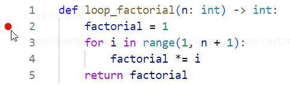 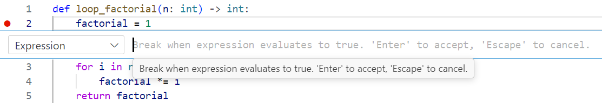
4. Перейти в панель "Run and Debug" (`Ctrl+Shift+D`), выбрать конфигурацию "Python: Current File" и нажать "Start Debugging" (`F5`) 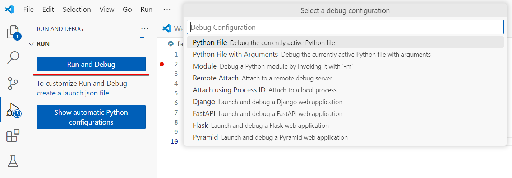
5. Использовать панель отладки для пошагового выполнения, просмотра переменных и управления выполнением. 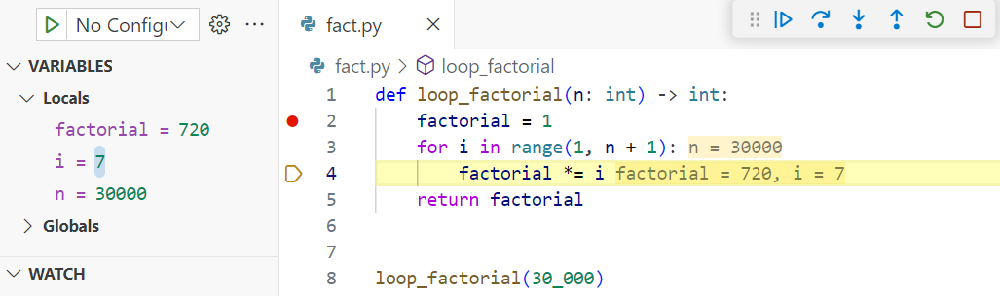

## Пример

Рассмотрим функцию, которая вычисляет максимальное произведение двух соседних элементов в списке чисел. Ошибка заключается в том, что функция предполагает, что список всегда содержит как минимум два элемента, что приводит к некорректному результату (например, возвращает 0 для списка из одного элемента).

**Шаг 1.** Создадим файл `max_pair.py` в папке проекта в VS Code с кодом этой функции. 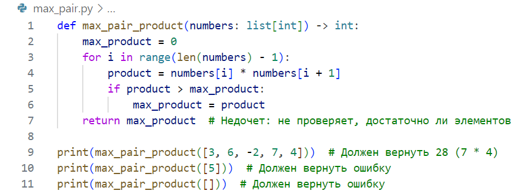

**Шаг 2.** Установим точку остановки на строке `product = numbers[i] * numbers[i + 1]`, щелкнув на левом поле рядом с номером строки. 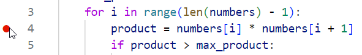

**Шаг 3.** Запустим отладку через `F5`. Выполнение остановится при первом вызове `max_pair_product([3, 6, -2, 7, 4])`. 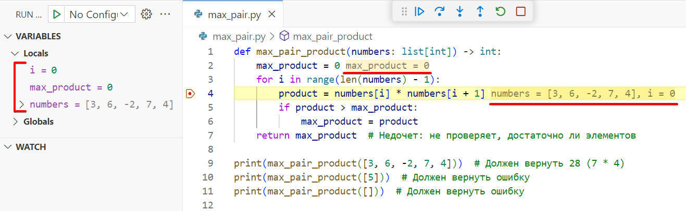

**Шаг 4.** Используем кнопку "Step Over" (F10) для прохождения цикла. Наблюдаем, как product принимает значения: `3 * 6 = 18`, `6 * -2 = -12`, `-2 * 7 = -14`, `7 * 4 = 28`. Проверим, как max_product обновляется до 18, затем до 28. Результат корректен. 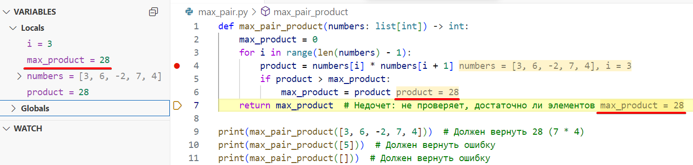

**Шаг 5.** Продолжим отладку (`F5`) для второго вызова (`max_pair_product([5])`) и третьего (`max_pair_product([])`). Отладчик не остановится на точке остановки, так как цикл не выполняется (`range(0)` пуст). В панели "Variables" увидим, что `max_product = 0`, что неверно, так как функция должна сигнализировать об ошибке для списка с одним элементом. 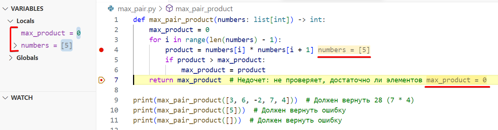 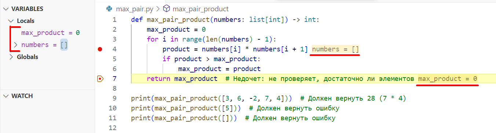

**Шаг 6.** Исправим код, добавив проверку количества элементов. 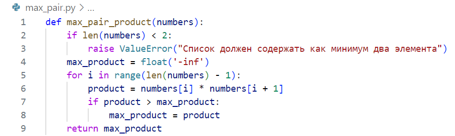

**Шаг 7.** Перезапустим программу и увидим ошибку при вызове `max_pair_product([5])`. 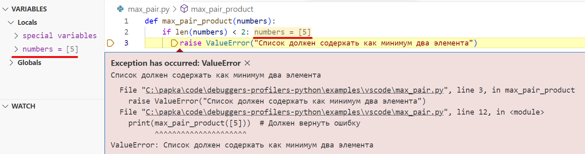

## Ссылки

- [Официальный сайт VS Code](https://code.visualstudio.com/)
- [Документация VS Code](https://code.visualstudio.com/docs)

