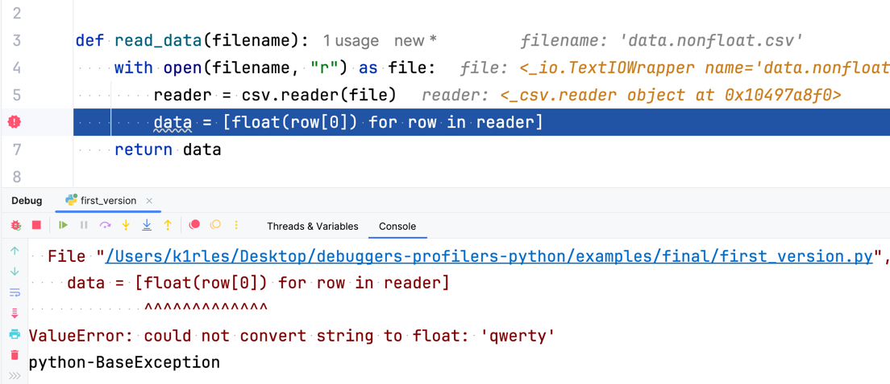
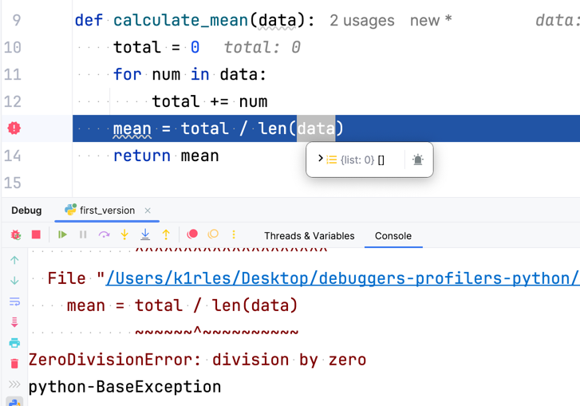

# 3. Тестирование и оценка результатов выполнения работы.

В этой главе мы практически применим инструменты отладки, профилирования и статического анализа, описанных в предыдущих главах, на примере около реального сценария. Возьмём скрипт для обработки числовых данных из csv-файла, который содержит ошибки и возможность оптимизации. Используя встроенный в PyCharm отладчик, cProfile, logging, ruff и mypy, попробуем устранить проблемы, увеличить производительность и улучшить качество кода.

## Задача

Рассмотрим программу, которая читает файл с числовыми данными (одно число в строке), вычисляет статистические показатели (среднее, медиану, стандартное отклонение) и записывает результаты в другой файл.

## Первая версия

[Первая версия программы](../examples/final/first_version.py)

Скрипт заранее содержит следующие проблемы:
- Ошибки в расчётах: стандартное отклонение считается неправильно, а нечисловые данные в файле ломают программу.
- Нет проверки на отсутствие данных в исследуемом файле.
- Вопросы к производительности: чтение больших файлов с помощью `csv.reader` выполняется медленно.

Предположим, что файл `data.csv` содержит числа, но некоторые строки содержат нечисловые данные, например, текст `"Н/д"`. Это вызовет сбой программы.
Или `data.csv` не содержит данных, тогда программа завершится с ошибкой `ZeroDivisonError`.

## Отладка с помощью PyCharm

Для поиска и устранения ошибок используем отладчик PyCharm. Запустим скрипт в режим отладки, тогда PyCharm покажет нам исключение и строку, на которой оно произошло.  

Исправление кода: Модифицируем функцию read_data, добавив обработку нечисловых значений. Также добавим условие - если файл пустой, то сразу запишем в ответ нули.

[Вторая версия программы](../examples/final/second_version.py)

## Отладка с помощью cProfile

Предположим, что нам нужно посчитать файл на 100 миллионов чисел. Сейчас работа программы занимает ~20 секунд. Попробуем запустить cProfile и узнать, что выполняется дольше всего.

[Вывод без cProfile](../examples/final/big-data-second-version.txt)

[Вывод cProfile](../examples/final/cprofile-second-version-output.txt)

Сразу видим, что вместо 20 секунд программа выполнялась почти 40, то есть в два раза дольше. Так профайлер влияет на производительность.
Заметим, что самые долгие функции - `read_data` и `calculate_std_dev`, а `calculate_mean` вызывается два раза. Попробуем взять более подходящий инструмент для анализа больших данных - `pandas`. Установим его через `pip install pandas` и перепишем наши функции:

[Третья версия программы](../examples/final/third_version.py)

[Вывод при работе программы с pandas](../examples/final/data-pandas.txt)

## Форматирование и аннотации типов

Теперь, когда программа работает за приемлемое время, можно подумать о качестве кода. Создадим `.ruff.toml` и `.mypy.ini`:

[Пример конфига для ruff](../examples/final/.ruff.toml)

[Пример конфига для mypy](../examples/final/.mypy.ini)

Скопируем третью версию в другой файл и отформатируем его: `ruff check --fix ./fourth_version.py`, `mypy ./fourth_version.py`

После исправления предупреждений ruff и mypy, получим последнюю версию скрипта:

[Четвёртая версия программы](../examples/final/fourth_version.py)

## Оценка результатов

Мы довели скрипт до рабочего состояния, решив все основные проблемы:
- Ошибки: добавили обработку некорректных данных и пустых файлов.
- Производительность: Переход на pandas сократил время выполнения с 20 секунд до 5 секунд на файле с 100 миллионами строк.
- Качество кода: ruff привёл код в соответствие с `PEP 8`, а mypy подтвердил типобезопасность.
- Прозрачность: logging сделал процесс выполнения понятным, с чёткими сообщениями о каждом этапе.

Вклад каждого инструмента:
- PyCharm Debugger: Помог быстро найти ошибки в обработке данных и расчётах. Интуитивный интерфейс и пошаговое выполнение сэкономили время.
- cProfile: Показал, что чтение файла и ручные вычисления были узкими местами, что привело к переходу на pandas.
- logging: Сделал процесс прозрачным, особенно полезно для больших файлов, где нужно отслеживать пропущенные строки.
- ruff: Устранил стилистические недочёты, сделав код аккуратным и удобным для команды (а в команде без единого стиля туго).
- mypy: Гарантировал, что код не сломается из-за ошибок типов.

## Вывод

Этот пример показал, как комплексное использование инструментов отладки, профилирования и статического анализа превращает проблемный скрипт в надёжный и быстрый инструмент. 

Полученные результаты применимы к реальным задачам, от анализа данных до серверных приложений. Эти инструменты не только решают конкретные проблемы, но и учат писать качественный код, который легче поддерживать и масштабировать. Теперь скрипт готов к использованию в реальных проектах, где важны скорость, надёжность и читаемость.
